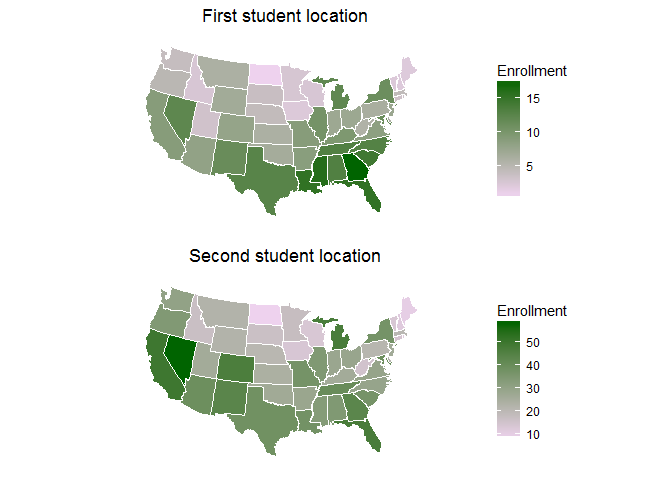

R for institutional research
================
Jordan Prendez
2016-09-02

-   [Points](#points)
-   [Statewide level](#statewide-level)
-   [Big Ten universities research funding](#big-ten-universities-research-funding)

Points
------

Named points on a map. 

``` r
library(leaflet)
library(webshot)

m <- leaflet() %>%
  addTiles() %>%  # Add default OpenStreetMap map tiles
  addMarkers(lng=-76.930576, lat=38.993662, popup="The Estate") %>%
  addMarkers(lng=-76.954220, lat=39.004796, popup="University System of Maryland")
m  # Print the map
```


[logo]: https://raw.githubusercontent.com/nietsnel/nietsnel.github.io/master/IR_files/figure-markdown_github/unnamed-chunk-3-3.png "Logo Title Text 2"


Graphic here.

Statewide level
---------------

``` r
us <- map_data("state")
arr <- as_data_frame(USArrests) %>% 
  rownames_to_column("region") %>% 
  mutate(region=tolower(region)) %>%
  rename(Enrollment = Murder)

gg <- ggplot()
gg <- gg + geom_map(data=us, map=us,
                    aes(x=long, y=lat, map_id=region),
                    fill="#ffffff", color="#ffffff", size=0.15)
gg <- gg + geom_map(data=arr, map=us,
                    aes(fill=Enrollment, map_id=region),
                    color="#ffffff", size=0.15)
gg <- gg + scale_fill_continuous(low='thistle2', high='darkgreen', 
                                 guide='colorbar')
gg <- gg + labs(x=NULL, y=NULL)
gg <- gg + coord_map("albers", lat0 = 39, lat1 = 45) 
gg <- gg + theme(panel.border = element_blank())
gg <- gg + theme(panel.background = element_blank())
gg <- gg + theme(axis.ticks = element_blank())
gg1 <- gg + theme(axis.text = element_blank()) + ggtitle("First student location")


##second graph..[almost same code. Different dataset, different color]

us <- map_data("state")
arr <- as_data_frame(USArrests) %>% ##This is a vis for demonstration only. 
  rownames_to_column("region") %>%  ##The dataset is on violent crime and is not related to IR.
  mutate(region=tolower(region)) %>%
  rename(Enrollment = Murder) %>%
  mutate(Enrollment=Enrollment+Rape)  

gg <- ggplot()
gg <- gg + geom_map(data=us, map=us,
                    aes(x=long, y=lat, map_id=region),
                    fill="#ffffff", color="#ffffff", size=0.15)
gg <- gg + geom_map(data=arr, map=us,
                    aes(fill=Enrollment, map_id=region),
                    color="#ffffff", size=0.15)
gg <- gg + scale_fill_continuous(low='thistle2', high='darkgreen', 
                                 guide='colorbar')
gg <- gg + labs(x=NULL, y=NULL)
gg <- gg + coord_map("albers", lat0 = 39, lat1 = 45) 
gg <- gg + theme(panel.border = element_blank())
gg <- gg + theme(panel.background = element_blank())
gg <- gg + theme(axis.ticks = element_blank())
gg2 <- gg + theme(axis.text = element_blank())+ ggtitle("Second student location")


grid.arrange(gg1, gg2, ncol=1) ##graphs both
```



Big Ten universities research funding
-------------------------------------

This graph compares external research funding of Big 10 universities in the top 40 nationwide.

``` r
library(dplyr)
library(maps)
library(leaflet)

cities <- read.csv(textConnection("
                                  City,Lat,Long,Pop
                                  UIndiana, 39.169763, -86.516894,645966
                                  UMaryland, 38.986125, -76.942889, 931406
                                  UMichigan, 42.277472, -83.736706, 1322711
                                  UWisconsin, 43.076937, -89.412209, 1169779
                                  UMinnesota, 44.974377, -93.227750 ,826173
                                  PennState, 40.797425, -77.860423, 797679
                                  OhioState, 40.013599, -83.031183, 766513
                                  PurdueU, 40.424498, -86.921302, 602501
                                  Uillinois, 40.102715, -88.226893, 583754
                                  MichiganState,42.701430, -84.482236, 507061
                                  "))

leaflet(cities) %>% addTiles() %>% addCircles(lng = ~Long, lat = ~Lat, weight = 1, 
    radius = ~sqrt(Pop) * 50, pop
 = ~City)
```

image here
